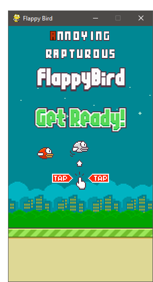

FlappyBirdTT 
===============

Flappy Bird Tying Tutor Clone is made using [python-pygame][1]

This game is heavily based on [Sourab's FlappyBird Clone][2]

How-to
------

1. Install Python 2.7.X or 3.6.x from [here](https://www.python.org/download/releases/)

2. Install PyGame 1.9.X from [here](http://www.pygame.org/download.shtml)

3. Clone this repository: `git clone https://github.com/ulfimlg/FlappyBirdTT.git` or click `Download ZIP` in right panel and extract it.

4. Run `python flappy.py` from the repo's directory

5. Press the first alphabet <kbd>Key</kbd> to start to play, continue typing to keep the bird flapping and press <kbd>Space</kbd> to restart the game once you loose.

  (Note: Install pyGame for same version python as above)

  (For x64 windows, get exe [here](http://www.lfd.uci.edu/~gohlke/pythonlibs/#pygame))

ScreenShot
----------

[1]: http://www.pygame.org
[2]: https://github.com/sourabhv/FlapPyBird
